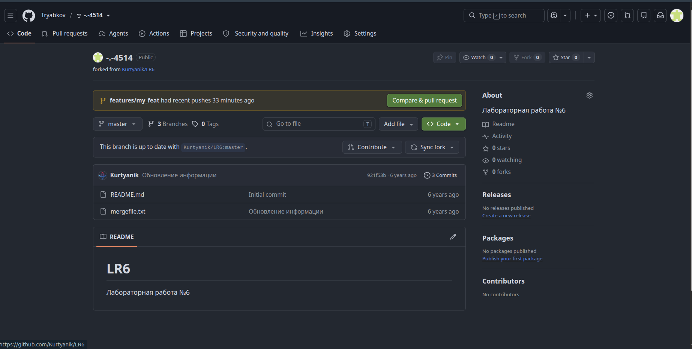
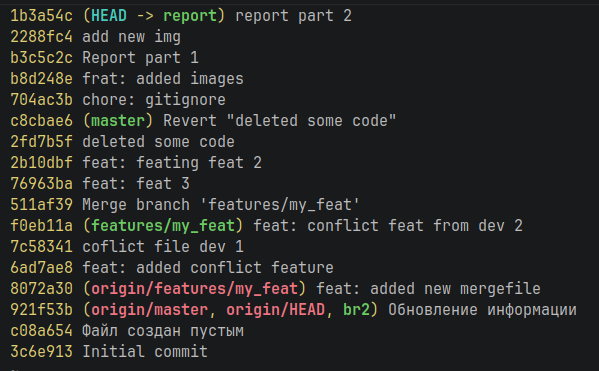
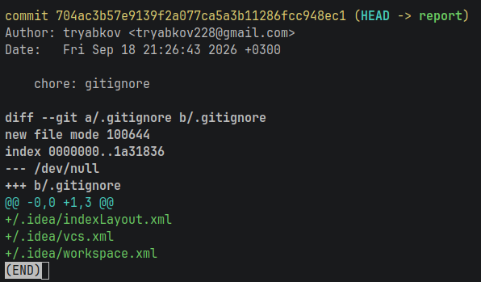
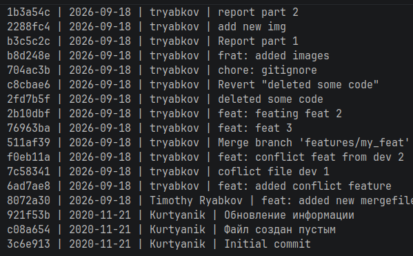

# LR6
## **Лабораторная работа №6**

### 1 Цель лабораторной работы
Изучение базовых возможностей системы
управления версиями, опыт работы с Git Api, опыт работы с локальным и
удаленным репозиторием.

### 2 Ход работы

#### 2.1 Создание аккаунта GitHub
Для выполнения лабораторной работы был создан аккаунт на платформе GitHub.
После этого был открыт исходный репозиторий:
https://github.com/Kurtyanik/LR6/
С помощью функции Fork была создана его копия в личном аккаунте GitHub (рис. 1).

Рисунок 1 - Fork репозитория

#### 2.2 Работа с репозиторием
Созданный на GitHub репозиторий был клонирован на локальный компьютер.

Через веб-интерфейс GitHub в репозиторий был добавлен новый файл.

После этого изменения были загружены в локальный репозиторий командой:

    git pull

В результате локальная версия проекта была синхронизирована с удалённым репозиторием.

Для просмотра существующих веток использовалась команда:

    git branch

История изменений была просмотрена с помощью команды (рис. 2):

    git log --oneline --all --graph --decorate

Рисунок 2 - История изменений

Графическое отображение истории позволило увидеть последовательность коммитов и расположение веток относительно друг друга.

Для просмотра последних выполненных изменений использовалась команда (рис. 3):

    git show

Рисунок 3 - Последнее изменение

Для выполнения слияния был осуществлён переход в основную ветку:

    git checkout master

После этого было выполнено слияние побочной ветки:

    git merge <имя-ветки>

Во время слияния возник конфликт изменений. Конфликтующие участки файла были отредактированы вручную (рис. 4).

Рисунок 4 - Решение Merge-конфликта

После успешного слияния ненужная ветка была удалена:

    git branch -d <имя-ветки>

В файл проекта были внесены несколько изменений.

После каждого изменения выполнялись создание нового коммита:
    git commit -m "Message"

Для отмены изменений последнего коммита использовалась команда:

    git revert HEAD

Данная команда создаёт новый коммит, отменяющий изменения предыдущего коммита, при этом история репозитория сохраняется.

Для оформления отчёта была создана отдельная ветка:

git checkout -b report

В данной ветке был создан и отредактирован файл README.md.

Для получения истории операций в требуемом формате использовалась команда:

    git log --pretty=format:"%h | %ad | %an | %s" --date=short

Рисунок 5 - История коммитов

### Выводы
В ходе лабораторной работы были изучены основные возможности системы контроля версий Git и платформы GitHub. Был создан удалённый репозиторий с помощью Fork, выполнено его клонирование на локальный компьютер.

В процессе работы были освоены операции получения и просмотра изменений, создание коммитов и веток, просмотр истории репозитория, слияние веток и разрешение конфликтов. Также был выполнен откат изменений одного из коммитов и создана отдельная ветка для оформления отчёта.

В завершение работы локальные изменения были отправлены в удалённый репозиторий GitHub. Таким образом, были получены практические навыки работы с локальными и удалёнными Git-репозиториями.